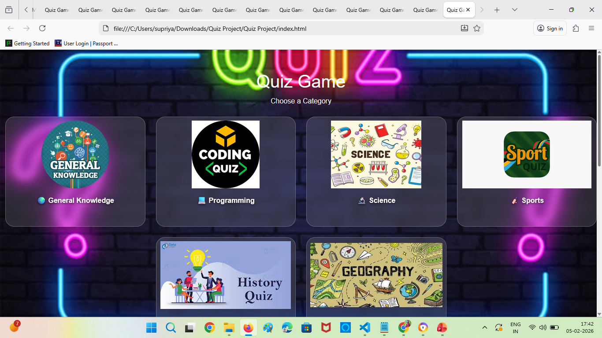

# Quiz-Game
This project is an interactive quiz game 
It is developed using :
- HTML 
- CSS  
- JavaScript
  
HTML is used for structure, CSS for styling and JavaScript to add logic.
This application allows users to answer multiple-choice questions, tracks their score.
It instantly displays win or lose results.

Core features of our Quiz Game:
- Dynamic Question Display
- Real-time score tracking
- Instant Feedback and scoring
- Flexible Quic Control
- Instant answer validation

Project starts its execution from index.html page. All the validations are given in script file.

To execute this project,
From the Visual Studio Code, install the browser extension and run
## Screenshots
### Home Page

